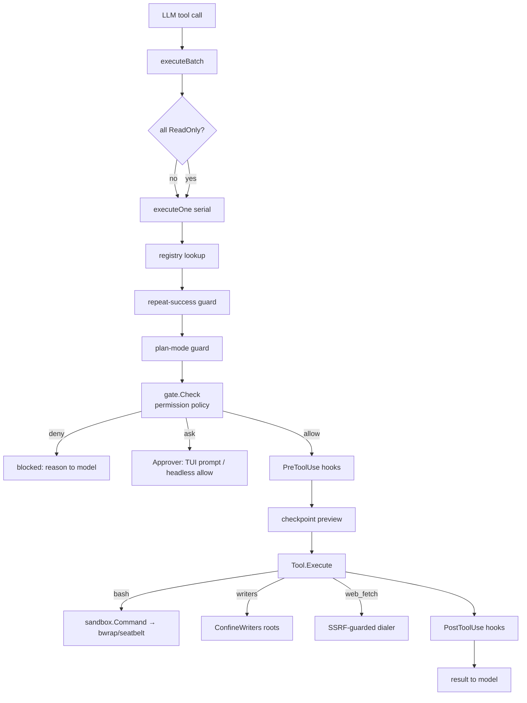

# Reasonix Current Architecture

Audit of Reasonix `main-v2` at commit `ece9b77` (branch `research/secure-runtime`). This document describes the harness as it actually works on Linux, before any security-control-plane work. Everything here was read from source; where behaviour is inferred, it is marked as such.

## 1. Package / module map

Single Go module (`reasonix`), Go 1.26, zero-CGO build. Entry point `cmd/reasonix/main.go` blank-imports provider and builtin-tool packages for init-time registration.

| Package | Responsibility |
|---|---|
| `internal/cli` | CLI lifecycle: chat TUI, headless run, serve, acp, slash commands; wires controller |
| `internal/boot` | **Composition root**: builds controller, agent, gate, confined tools, hooks, MCP plugins from config |
| `internal/control` | Transport-agnostic `Controller` behind every frontend (TUI, serve, desktop); owns interactive approval gate swap |
| `internal/agent` | Agent loop: one task, provider streaming, tool dispatch, gate consultation, compaction, sub-agents (`task`) |
| `internal/provider` | Model/provider abstraction; anthropic + openai packages self-register |
| `internal/tool` | `Tool` interface + per-run `Registry`; `builtin/` self-registers all built-ins |
| `internal/permission` | Pure `Policy` (deny > ask > allow > fallback) + `Gate` wrapper with optional `Approver` |
| `internal/sandbox` | `Spec` + `Command` wrapping shell invocation in OS jail (Seatbelt on darwin, bwrap on linux); `Shell` abstraction |
| `internal/tool/builtin` | bash, file writers, grep/glob/ls, web_fetch (SSRF-guarded), task, memory tools, codegraph |
| `internal/plugin` | Plugin system: MCP servers, skills, hooks, plugin tools incl. `mcp__server__tool` namespace |
| `internal/config` | TOML config, MCP JSON, env, sandbox/permission sections, model fallback |
| `internal/hook` | PreToolUse/PostToolUse shell hooks (only loaded when project trusted) |
| `internal/jobs` | Background bash jobs across turns |
| `internal/command` | Slash-command loading; prompt templates exposed via the `slash_command` tool (gated like any tool; no unsandboxed user shell here) |
| `internal/acp` | Agent Client Protocol server (another frontend) |
| `internal/checkpoint`, `internal/evidence`, `internal/memory`, `internal/instruction` | Turn rewind, verification ledger, auto-memory, project checks |
| Others | `proc` (kill trees), `netclient`, `fileutil`, `diff`, `event`, `i18n`, `billing`, `lsp`, `codegraph`, `inspect`, `doctor` |

## 2. Execution flow

```
main.go → cli.Run → boot → control.Controller → agent.Agent.Run
```

One `Controller` behind every frontend. `boot` builds everything; the controller adds interactive behaviour (approval prompts, slash commands, checkpoint wiring).

## 3. Tool invocation flow (the pipeline you will intercept)

```
LLM tool call (provider.ToolCall)
  → agent.executeBatch (parallel only when all calls ReadOnly)
    → agent.executeOne:
      1. registry lookup            (unknown → "error: unknown tool")
      2. repeat-success loop guard  (blocks repetitive identical calls)
      3. plan-mode guard            (writer tools refused in plan mode)
      4. a.gate.Check(ctx, name, args, readOnly)   ← PERMISSION GATE
      5. PreToolUse hooks           (can block, exit 2)
      6. Preview → onPreEdit checkpoint snapshot
      7. context enrichment: evidence ledger, project checks, jobs, memory, progress
      8. t.Execute(ctx, args)       (raw JSON args; returns result string)
      9. PostToolUse hooks          (observe only)
     10. outcome → model (truncated, with error text for self-correction)
```

`Gate` is an interface (`Check` returns `allow, reason, err`); a nil gate means no gating, and a denial feeds `"blocked: <reason>"` back to the model as tool output.

## 4. Permissions flow

`permission.Policy` = pure rule evaluation. `Rule{Tool, Subject, Literal}` with glob subjects. Precedence: `deny > ask > allow > readOnly-fallback(Allow) > Mode-fallback`. Rules parsed from Claude-Code-style strings (`Tool(subject)` or legacy `Tool=literal`).

`permission.NewGate(policy, approver)` wraps policy in a Gate; with nil approver, `Ask` resolves to allow (headless autonomy). Interactive frontends swap in a gate with a real `Approver` via `Controller.EnableInteractiveApproval` — the TUI prompts the user with an approval card. Session grants reuse `RuleMatchesString` so config and runtime grants share matching semantics.

Wiring (boot.go): config `permissions.mode/allow/ask/deny` → policy → headless gate → `Agent.Options.Gate`; `controller.go:847` swaps it for interactive approval. Sub-agents always run headless with the inherited gate.

## 5. Sandbox flow

`sandbox.Spec{Mode, WriteRoots, Network}` zero value = unconfined. `sandbox.Command(spec, shell, command)` builds argv: on linux with bwrap present and Mode=="enforce", wraps as `bwrap --unshare-net --ro-bind / / --dev /dev --proc /proc --tmpfs /tmp --bind <root> <root> ... sh -c <command>`; network re-enabled by dropping `--unshare-net`. Writes confined to WriteRoots; temp dirs tmpfs; whole root read-only bind. `Available()` only checks bwrap on PATH.

Two confinement layers:
- OS jail for bash via `ConfineBash(spec, timeout)` (rebinds the registered bash built-in).
- In-process path confinement for file writers via `ConfineWriters(roots)`: write_file/edit_file/multi_edit/notebook_edit/delete_range/delete_symbol reject targets outside symlink-resolved workspace roots (`realPath` walks deepest existing ancestor, so symlinked dirs cannot smuggle writes).
- `web_fetch` has an SSRF-guarded dialer.

Custom slash commands are prompt templates exposed through the `slash_command`
tool — they go through the same gate as any tool call and execute no shell of
their own (outdated earlier claim: nothing in `internal/command` runs
unsandboxed user shell). Background jobs run under the sandbox spec too.

## 6. Important interfaces

```go
// internal/agent
type Gate interface {
    Check(ctx context.Context, toolName string, args json.RawMessage, readOnly bool) (allow bool, reason string, err error)
}
type ToolHooks interface { PreToolUse(...) (block bool, message string); PostToolUse(...); ... }

// internal/tool
type Tool interface {
    Name() string; Description() string; Schema() json.RawMessage
    Execute(ctx context.Context, args json.RawMessage) (string, error)
    ReadOnly() bool
}
type Previewer interface { Preview(args json.RawMessage) (diff.Change, error) }

// internal/sandbox
type Spec struct { Mode string; WriteRoots []string; Network bool }
func Command(spec Spec, sh Shell, command string) (argv []string, wrapped bool)

// internal/permission
type Policy struct { Mode Decision; Allow, Ask, Deny []Rule }
func (p Policy) Decide(toolName string, readOnly bool, args json.RawMessage) Decision // Allow|Ask|Deny
type Gate struct { ... } // implements agent.Gate
```

## 7. Extension points

1. `Agent.SetGate` / `Options.Gate` — the per-call decision point. Already interface-shaped.
2. `ToolHooks` — PreToolUse can block; runs after gate. Secondary hook, not the choke point.
3. `tool.Registry` per run; tools namespaced; MCP tools `mcp__server__tool`.
4. Plugin system adds tools, skills, hooks, MCP servers at runtime.
5. `confine.go` `ConfineBash/ConfineWriters/ConfineWebFetch` — per-run tool binding at the composition root.
6. `event.Sink` — typed event stream; ToolDispatch/ToolResult events already emitted.
7. Providers self-register; frontends all go through `Controller`.

## 8. Technical debt relevant to this project

- `seatbelt_other.go` doc comment ("no OS sandbox on this platform") is stale: bwrap support exists on linux. `sandbox_test.go` expectations (`TestCommandNonDarwin` "never wrap", `TestAvailableNonDarwin` "unavailable") contradict the bwrap implementation — stale tests predating the bwrap change.
- ~~`Available()` reports bwrap available without verifying a namespace can actually be created~~ — **fixed (M13)**: `Available()` now runs a real bwrap self-test (`--ro-bind / / --unshare-net … /bin/true`, 10s timeout, cached) and reports false when userns is blocked on this host; boot distinguishes "bwrap absent" from "installed but self-test failed". Landlock ABI detection added (`LandlockABI()` via `/sys/kernel/security/landlock/abi` or `prctl(PR_LANDLOCK_CREATE_RULESET)` probe); landlock confinement itself lands in a later milestone.
- `sandbox.go` header comment likewise says "Only macOS (Seatbelt) is implemented".
- ~~Sandbox tests failing on this host~~ — **fixed (M13)**: stale expectations replaced with probe-consistent assertions; `TestBashSandboxConfinement` skips when bwrap is unusable instead of failing. Full suite now green (42 `ok`, 0 `FAIL`).
- No provenance concept anywhere: tool args carry no origin tag; file content entering the model is indistinguishable from user instructions.
- Permission gate is model-visible text for denials but has no structured audit trail beyond the event sink.
- Capabilities are coarse: file-writer roots and shell jail are per-run globals; no scoped per-goal or per-origin authority.

## 9. Candidate security interception points

1. `agent.Gate.Check` (agent.go:1012) — every tool call, after plan-mode guard. **Narrowest common point.** Already interface-shaped, already wired with config policy, already swapped per frontend.
2. `boot.go` tool construction (ConfineBash/ConfineWriters) — build-time binding; right place for sandbox specs and capabilities, wrong place for per-call policy.
3. `tool.Tool.Execute` wrapper — would require wrapping every tool individually (against the one-choke-point principle).
4. `agent.executeOne` inline — would fork the agent package.
5. Hooks PreToolUse — runs after gate, user-configured shell code; not authoritative enough.

## 10. Recommended interception point

**`agent.Gate.Check`.**

Justification:
- Every model-initiated tool call crosses it exactly once, in both interactive and headless modes, including background bash launches.
- It receives `(ctx, toolName, args, readOnly)` — enough to build typed `ExecutionRequest` with parsed arguments, requested resources, provenance and intent context.
- The existing `permission.Gate` can become the ASK resolution layer (user approval UX) inside the new gate — integrating rather than duplicating the permission system, as required.
- Nothing calls a tool without crossing it under normal operation. The only known non-gated shell paths are user-initiated slash commands (deliberate; out of scope for model-action policy) and plan-mode refusal (earlier guard, complementary).
- Extending a single existing abstraction beats creating a parallel one: the security control plane becomes a new `agent.Gate` implementation composed from policy/capability/provenance/risk/audit subpackages, installed at the same `SetGate` seam the interactive TUI already uses.

## Pipeline diagram



## Verification baseline (evidence)

- `go build ./...` PASS; `go vet ./...` PASS.
- `go test ./...`: 42 packages `ok`, 0 `FAIL` (M13: sandbox probe + stale-test cleanup).
- Sandbox runtime confinement is unavailable on this host regardless of implementation; the security gate and policy layers are fully testable without it. Environment limitation, not code regression. See `docs/DEVELOPMENT.md` for reproduction.