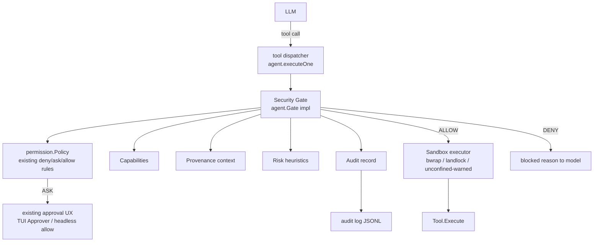

# Target architecture: security control plane for Reasonix

Design document for the research contribution: a security control plane intercepting every model-initiated tool call in Reasonix. Base harness: Reasonix (audit in `reasonix-current.md`). Donor mechanisms mapped in `../references/` — this document is the consensus design, written before the first implementation line.

## Principles (from the project brief)

1. One security choke point, below the model.
2. Enforcement by construction, not by model judgement.
3. Stateful execution never equals unrestricted execution.
4. Explicit, granular authority beats global booleans.
5. Provenance is data, not a comment.
6. Decisions are explainable; nothing relies on opaque scores alone.
7. The gate integrates the existing permission UX, it does not duplicate it.
8. Sandbox is depth, not the only control. Gate stays authoritative.
9. Extension over replacement: whenever Reasonix already has the abstraction, extend it.

## Where the control plane sits



Reasonix already routes every call through `agent.Gate.Check`. The control plane is a new `agent.Gate` implementation composed of dedicated subpackages; the existing `permission.Gate` becomes its ASK-resolution layer. No tool-specific security logic anywhere.

## Typed abstractions

Follow Go/Reasonix conventions (JSON-tagged structs, context-first signatures). These live in a new `internal/security` package.

```go
// Origin of the action or of the content that motivated it.
type Origin string // OriginUser | OriginModel | OriginTool | OriginFile | OriginWeb | OriginMCP | OriginKernel | OriginSystem

// ExecutionRequest: everything the gate needs, built at the choke point.
type ExecutionRequest struct {
    Actor        string          // "model" | "tool" | "kernel" | "user"
    SessionID    string
    Tool         string          // tool name incl. mcp__server__tool
    Operation    string          // derived: e.g. "read" | "write" | "execute" | "connect"
    Arguments    json.RawMessage // raw args handed to the tool
    Resources    []ResourceRef   // requested resources parsed from args (paths, host:port, command)
    Provenance   []Provenance    // origin chain of the request and its content
    IntentContext string         // short user-visible summary (ask/deny explanations)
}

type SecurityDecision struct {
    Action             Decision // ALLOW | ASK | DENY
    Reason             string   // human-readable, model-visible on deny
    MatchedPolicies    []string
    GrantedCapabilities []string
    Risk               RiskLevel
    AuditID            string
}

type ExecutionResult struct {
    Output     string
    Err        error
    Artifacts  []string
    Provenance []Provenance
    AuditID    string
}
```

Note: `ExecutionResult` is produced by existing tools; the gate wraps them and the audit layer correlates calls via `AuditID` (pre- and post- records). Result struct exists for the future kernel bridge milestone; the gate contract itself is `agent.Gate`.

## Capabilities

Granular, scoped authority strings; not booleans.

```
filesystem.read:/workspace/project
filesystem.write:/workspace/project/src
process.execute
network.connect:github.com:443
mcp.call:github
python.execute
```

`Capability` struct: `{ID, Owner, SessionID, Scope, ExpiresAt (optional), Provenance, DelegatedFrom (optional)}`. A session grants a set of capabilities at start (from config + workspace); tools map to required capabilities at the gate via the existing `Tool` name and parsed args. Deny-by-default: no capability → DENY (unless an ASK path exists).

Future delegation (children/kernel) reuses the same struct with `DelegatedFrom` — subset property enforced at grant time.

## Provenance

First-class metadata attached to every request and every audit record. Tracked origins: the enum above. Two distinct carriers:

1. **Request provenance**: who requested the action (always starts `OriginModel` for tool calls; `OriginUser`/`OriginKernel` for other paths).
2. **Content provenance**: where the *content influencing* the action came from. This is the poison-detection carrier: file text read into context marks subsequent privileged requests with `OriginFile`; a web_fetch result marks `OriginWeb`.

Phase-11 scenario enforcement (no semantic model needed):

```
README.md (attacker content) → tool read_file result → provenance[FILE] recorded
  → model calls bash: cat ~/.ssh/id_rsa
  → capability check: no filesystem.read:~/... → DENY
  → audit: origin FILE, decision DENY, reason "credential path outside granted scope"
```

The gate denies on *authority* (capability), not on intent. Provenance feeds risk scoring and audit; it does not by itself gate (deterministic policy stays authoritative).

## Policy engine

Start deterministic, reusing `permission.Policy` semantics (deny > ask > allow > fallback) with additions:

- Default policy additions evaluated at the gate before existing rules: DENY credential/SSH paths for read tools (`.ssh/`, cloud credential dirs), DENY dangerous process patterns, ASK for first-time external egress or side effects, ALLOW project-local reads within granted capability scope.
- Rule → capability mapping: existing rules stay; new capability rules are expressed as `capability:<id>` rule subjects so the config syntax stays uniform.
- Every decision records `MatchedPolicies` (rule IDs) — explainability is a requirement, so no flat score-only paths.
- Future semantic/learned policy can attach behind the same interface; it may only *add* deny/ask signal, never silently override explicit policy (brief: risk must not override policy).

## Risk engine

Separate package; initially heuristic, always advisory:

- Inputs: provenance chain, operation type, resource targets, command tokens, accumulated authority, unusual chains (e.g. subprocess spawning subprocess), dangerous argument combos.
- Output: `RiskLevel` (low/medium/high/critical) attached to the decision.
- Risk may escalate Ask (needs user approval) or inform DENY reason wording. It never downgrades a policy DENY to ALLOW.
- Interface designed for a future learned/semantic scorer to attach (same input struct, same output level).

## Audit

Structured JSONL, one record per gate decision (and per execution completion):

```json
{"ts":"...","session":"...","actor":"model","tool":"bash","operation":"execute",
 "args_redacted":"...","provenance":["USER"],"capabilities":["process.execute"],
 "policy":"...","risk":"low","decision":"ALLOW","execution_status":"ok","audit_id":"..."}
```

- Args are stored redacted (sized, sensitive keys masked); never raw secrets.
- Audit file lives outside agent write reach; written synchronously before execution and updated after.
- This becomes the tamper-evidence baseline for the evaluation harness (attack detection = audit assertions).

## Sandbox executor

Platform-neutral interface (`internal/sandbox` extension):

```go
type SandboxPolicy struct {
    Workspace      string
    ReadablePaths  []string // scoped grants; base = workspace + toolchain
    WritablePaths  []string
    Network        bool     // default false
    Environment    []string // sanitised allowlist policy
    Process        ProcessPolicy
}
```

Linux backends, chosen at runtime by capability probe (Codex lesson):

1. **bwrap** (namespaces): argv composition upgraded to Codex layering (`--tmpfs /` + scoped `--ro-bind` grants + `--bind` writable roots + re-applied `--ro-bind` protected subpaths; `--unshare-net` default; `--unshare-user --unshare-pid`; Pdeathsig).
2. **landlock** fallback (unprivileged hosts without userns — this machine): path_beneath rules, `/` read allowed only where granted.
3. **Unconfined-with-warning** (neither available): boot/ACP warning; gate remains authoritative.

The bash tool keeps its current behaviour for safe ops; only argv construction and risk/policy inputs change behind the gate.

## Integration points (final)

| Component | Location in Reasonix | Change |
|---|---|---|
| Gate | `internal/agent` `Gate` interface | New implementation in `internal/security/gate`; installed via existing `SetGate` |
| Permission UX | `internal/permission` | Consumed as ASK resolution inside the gate; not replaced |
| Sandbox | `internal/sandbox` + `internal/tool/builtin/confine.go` | Extended bwrap args; landlock backend; probe fix |
| Config | `internal/config` | New `security` section with safe defaults |
| Wiring | `internal/boot/boot.go` | Compose gate; pass capabilities; audit sink |
| Kernel (later) | `internal/kernel/*`, `runtime/python/*` | Bridge requests call the same gate (recursive authority) |
| Benchmarks | `benchmarks/` | Headless runs, twin grading, canary/attack scenarios |

## Milestone slicing (implementation order per brief)

1. `internal/security` types + pure policy/capability/provenance/risk/audit packages with unit tests.
2. Gate implementation wired at boot; existing permission UX as ASK layer; shell tools routed through gate + sandbox; regression: safe ops unchanged.
3. Sandbox backends (bwrap layering, landlock probe), confine updates.
4. Filesystem tools through the gate (capability-scoped reads/writes).
5. Audit + provenance recording complete; phase-11 prompt-injection scenario as a test.
6. Persistent Python kernel behind the same gate (later milestone, authority architecture first).

## Things deliberately not decided yet

- Whether capabilities are per-session config + workspace-derived only, or grow session grants via ASK approvals (likely both; decided at milestone 2).
- Exact `security` config keys (minimal set, decided at milestone 2 with config package).
- Whether risk engine ships in the first slice or as a stub interface (stub interface first; heuristics only if schedule allows — policy/capability/audit carry the security value).